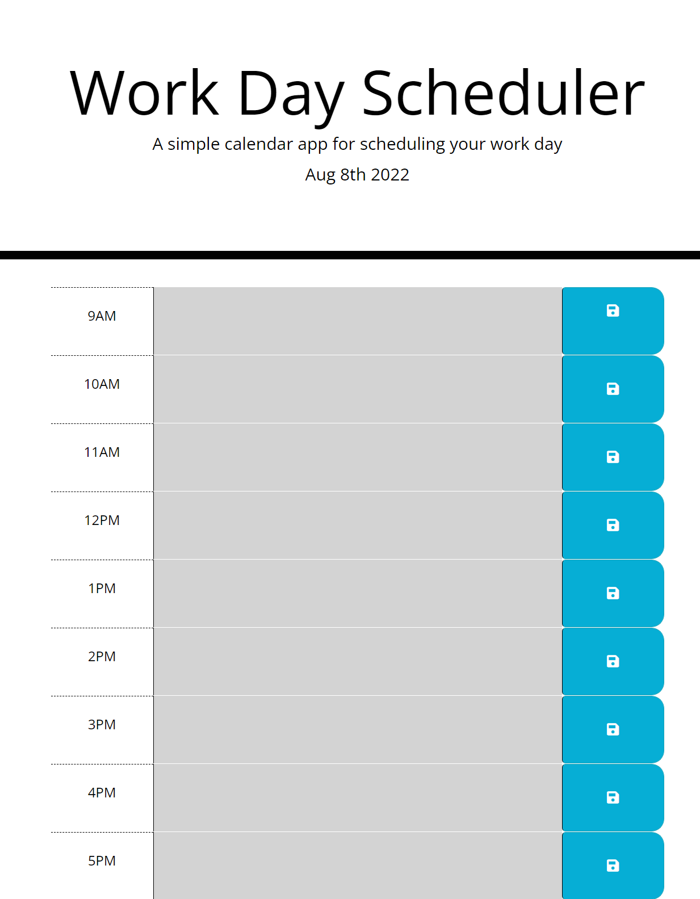

# Work_Day_Scheduler
Challenge 5

As an employee with a busy schedule I want to add important events to a daily planner so that I can manage my time effectively.

* Used moment.js to display the current day on the jumbotron
* Created blocks for events in HTML
* Block colors update relative to the current hour to show if they are in the past present or future
* Stores input in local storage so it persists between reloads

https://nickmagarian.github.io/Work_Day_Scheduler/

